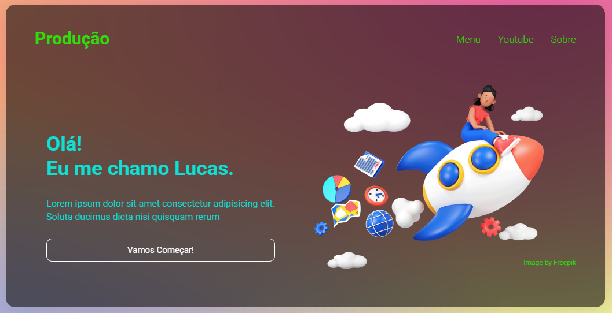

# Programming-Interface

##Programming Interface is a static interface project, developed using only HTML and CSS. It represents the visual layout of a platform focused on programming — such as a coding environment, project dashboard, or system for organizing files and languages.
## Although the project is not functional (it doesn't include back-end or JavaScript interactions), it focuses heavily on:

### + Modern and minimalist design
### + Intuitive visual organization
### + Semantic and responsive structure with HTML5
### + Clean and elegant styling with pure CSS

## This project serves as a visual prototype or a front-end practice exercise, ideal for demonstrating skills in interface structure and layout best practices.

